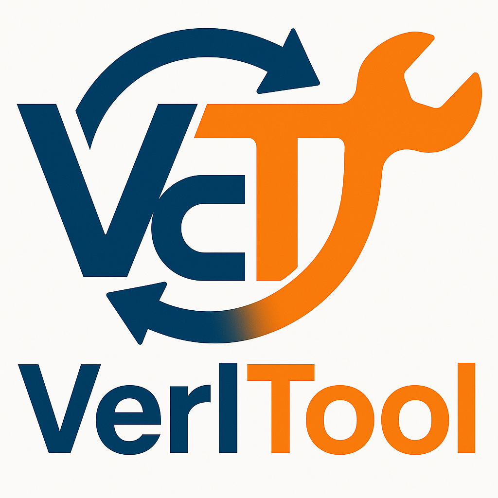

# Verl-Tool

<p align="center">
  <picture>
    <source media="(prefers-color-scheme: dark)" srcset="assets/imgs/logo.png">
    
  </picture>
</p>

<h3 align="center">
VerlTool: An unified and easy-to-extend tool-agent training framework based on verl.
</h3>

---

## Table of Contents
- [News](#news)
- [Features](#features)
- [Installation](#installation)
- [Training](#training)
  - [Single Node Training](#single-node-training)
  - [Multi Node Training](#multi-node-training)
- [Evaluation](#evaluation)
- [Test Tool Servers](#test-tool-servers)
- [ToDos](#todos)
- [Contribution](#contribution)
  - [Contribution to tool libraries](#contribution-to-tool-libraries)
  - [New reward manager](#new-reward-manager)

<!-- <p align="center">
| <a href="https://docs.vllm.ai"><b>Documentation</b></a> | <a href="https://blog.vllm.ai/"><b>Blog</b></a> | <a href="https://arxiv.org/abs/2309.06180"><b>Paper</b></a> | <a href="https://x.com/vllm_project"><b>Twitter/X</b></a> | <a href="https://discuss.vllm.ai"><b>User Forum</b></a> | <a href="https://slack.vllm.ai"><b>Developer Slack</b></a> |
</p> -->


## News
+ [2025/05/31] We release the training/eval code and our blog. We are working on the paper and will release it very soon.


## Features

- **Native RL Framework for Training Tool-Calling Agents.** `verl-tool` natively supports **multi-turn interactive loops** between agents and their environments.
- **Developer Friendly.** By integrating `verl` as a submodule, `verl-tool` abstracts away the complexity of RL training. Developers only need focus on building their tools following simple templates.
- **Fast Tool Server with Multiple Tool Types.** `verl-tool` uses [Ray Serve](https://docs.ray.io/en/latest/serve/index.html) to asynchronously serve tools, ensuring full compatibility with verl agent training. See [./verl_tool/servers/tools](./verl_tool/servers/tools) for all available tools — each Python file represents a supported tool type.
- **Comprehensive Evaluation Suite.** , See [benchmarks](benchmarks). `verl-tool` allows you to instantly evaluate your models’ capabilities. Currently, it supports benchmarks for math and code models, with more domains to be added in the future.


## Installation
```bash
git submodule update --init --recursive
pip install uv # if not installed
uv sync
source .venv/bin/activate
uv pip install -e verl
uv pip install vllm==0.8.4
uv pip install flash-attn --no-build-isolation
uv pip install -e ".[acecoder,torl]"
uv pip install dill==0.4.0 fsspec==2025.3.2 protobuf==5.29.4
```
### Conda Version
```bash
git submodule update --init --recursive
conda create --name verl-tool-env python=3.10
conda activate verl-tool-env
pip install -e .
pip install -e verl
pip install vllm==0.8.4
pip install flash-attn --no-build-isolation
pip install -e ".[acecoder,torl]"
pip install dill==0.4.0
pip install fsspec==2025.3.2
pip install protobuf==5.29.4
```

## Features
1. Fully separated the tool server and the training logic. By passing a list of `action_stop_tokens` to the training script, each action ending with any of the tokens will be passed to the tool server and further processed by identifying the tool type based on the custom pasing logic in each tool (`parse_action` function). 
2. Fast Tool Server: We use [ray serve](https://docs.ray.io/en/latest/serve/index.html) to serve the tool servers, which is fully asynchronous and compatible with the verl training.
3. Multiple tool types, see [./verl_tool/servers/tools](./verl_tool/servers/tools) for all the avaiable tools. Each python file is a tool type we support.
4. Natural multi-turn RL with tool calling support by specifying the `max_turns` in the script.
5. We make [verl](https://github.com/volcengine/verl) as a submodule of this repo, and only add additional logics by inheriting the `ActorRolloutRefWorker` and `RayPPOTrainer`, making it easy to extend and maintain.

## Training
We will take torl (Tool-Integrated RL for Math) as an example. Check [examples](examples) for more examples. 

### Data preprocess
Prepare the data for training. You can use the provided script to preprocess the data. More examples can be found in [examples/data_preprocess](examples/data_preprocess).

```bash
python examples/data_preprocess/math_torl.py --data_source DigitalLearningGmbH/MATH-lighteval --local_dir data/math_torl # preprocess the data and save
```

### Single Node Training
We train the **torl-1.5B-Math** model using the command below. The training configuration can be found in [verl_tool/trainer/config/ppo_trainer.yaml](verl_tool/trainer/config/ppo_trainer.yaml) and [verl_tool/llm_agent/config.py](verl_tool/llm_agent/config.py). For other model types, examples can be found in [`examples/train`](examples/train).

```bash
bash examples/train/torl/torl_1.5b_math_hard.sh # train the model
```
Training tips:
1. For low VRAM GPUs, we recommend using set `do_offload=True`, `enforce_eager=True`, `tensor_parallel_size=1`, `use_dynamic_bsz=False`, and low `ppo_micro_batch_size_per_gpu`
2. If you encounter vllm generation stuck, try lower the `workers_per_tool` in the script, and use lower `gpu_memory_utilization` in the script.
3. For large VRAM GPUs, we recommend using set `do_offload=False`, `use_dynamic_bsz=True` for faster training.

### Multi Node Training
1. Head Node
```bash
ray start --head --dashboard-host=0.0.0.0 # start ray head node
bash examples/train/acecoder/train.sh # train the model
```
2. Worker Node
```bash
ray start --address='head_node_ip:6379' --block # start ray worker node
# no need to run the training script on worker node
```
### Logs 
The training step records are automatically saved in [`verl_step_records`](verl_step_records).

## Evaluation
Currently, we provide a comprehensive benchmark to evaluate both math and code models in [`benchmarks`](benchmarks).  
Support for more tasks will be added in the future.

## ToDos # TODO: update more servers 
- [ ] Async VLLM
- [ ] Add VLM servers and example training scripts

## Contribute your own tools 
### Contribution to tool libraries
Go to the [./verl_tool/servers/tools](./verl_tool/servers/tools) directory. Each tool has a name (e.g. `base`, `python_code`), the name of tool is exactly the name of the python file that you should create in the directory. See [./verl_tool/servers/tools/python_code.py](./verl_tool/servers/tools/python_code.py) for an example.

### New reward manager
Go to the [`./verl_tool/agent_workers/reward_manager`](./verl_tool/agent_workers/reward_manager) directory and add your new reward manager.  
Then, make sure update the `verl_tool/trainer/main_ppo.py` file to include your new reward manager.

